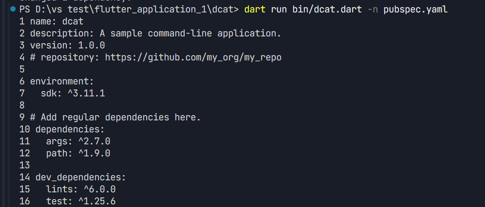

# flutter_application_1

Flutter & Dart 学习项目。

## 一、dcat — Dart 命令行工具

dcat 是一个用 Dart 实现的类 Unix `cat` 命令，支持 `-n` 参数显示行号。

参考文档：[Dart 命令行应用教程](https://dart.ac.cn/tutorials/server/cmdline#overview-of-the-dcat-app-code)

### 验证结果

已完成 dcat 基本功能验证，测试运行通过：

